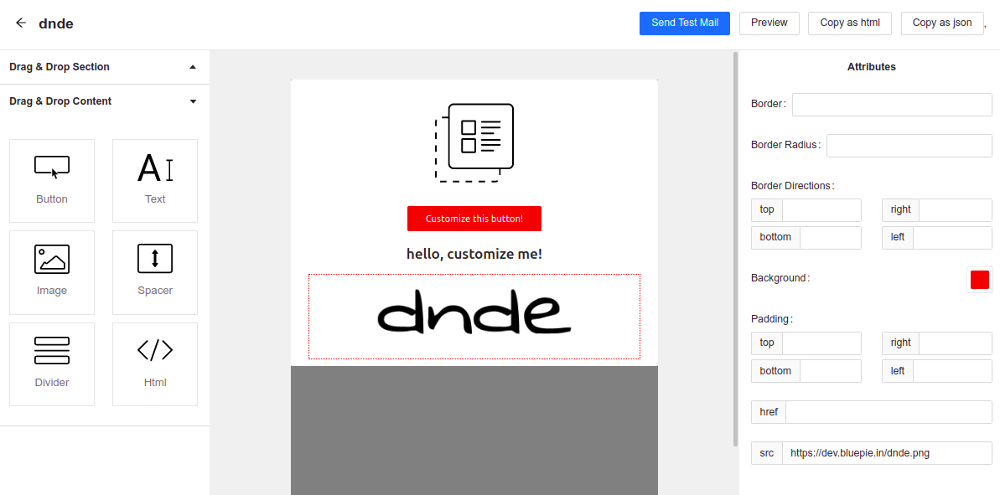

# Dnde

> drag and drop email editor for the web, built with [React](https://facebook.github.io/react/) and MJML [Mjml](https://mjml.io/).

[![release][badge]][release link] [![license][license-badge]][license file]

[license-badge]: https://img.shields.io/github/license/aghontpi/dnde?style=flat-square
[license file]: https://github.com/aghontpi/dnde/blob/master/LICENSE
[badge]: https://img.shields.io/github/v/release/aghontpi/dnde?include_prereleases&style=flat-square
[release link]: https://github.com/aghontpi/dnde/releases

## Preview

## Features

- Responsive and mobile friendly emails
- Design emails by dragging and dropping components.
- Export the design as html or json
- Preview the design in the browser
- Support for export and import via MJML JSON

## Built with

- [React](https://facebook.github.io/react/)
- [MJML](https://mjml.io/)
- [antd](https://ant.design/)
- [CKEditor](https://ckeditor.com/)
- [SendGrid](https://sendgrid.com/)
