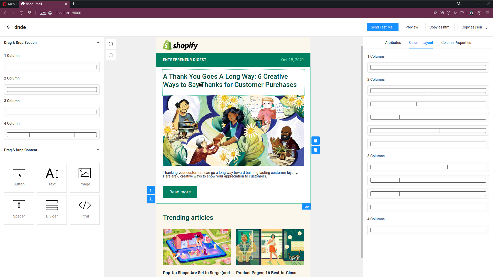

# Dnde - Mail (Drag and Drop Editor designed for mails)

> Drag and Drop E-mail editor for the web

[![release][badge]][release link] [![license][license-badge]][license file]

[license-badge]: https://img.shields.io/github/license/aghontpi/dnde?style=flat-square
[license file]: https://github.com/aghontpi/dnde/blob/master/LICENSE
[badge]: https://img.shields.io/github/v/release/aghontpi/dnde?include_prereleases&style=flat-square
[release link]: https://github.com/aghontpi/dnde/releases

## Preview

## Features

- Responsive and mobile friendly emails (achieved through MJML)
- Design emails by dragging and dropping.
- Export the design as html/json
- UNDO and REDO functionality
- Support for loading custom Fonts
- Preview the design in the browser (mobile & pc)
- Support for importing MJML JSON

## Built with

- [React](https://facebook.github.io/react/)
- [MJML](https://mjml.io/)
- [antd](https://ant.design/)
- [CKEditor](https://ckeditor.com/)
- [SendGrid](https://sendgrid.com/)

## Inspired by

- [MailJet](https://www.mailjet.com/)
- [Unlayer](https://unlayer.com/)
