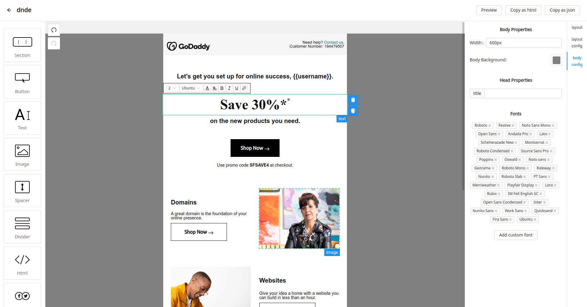
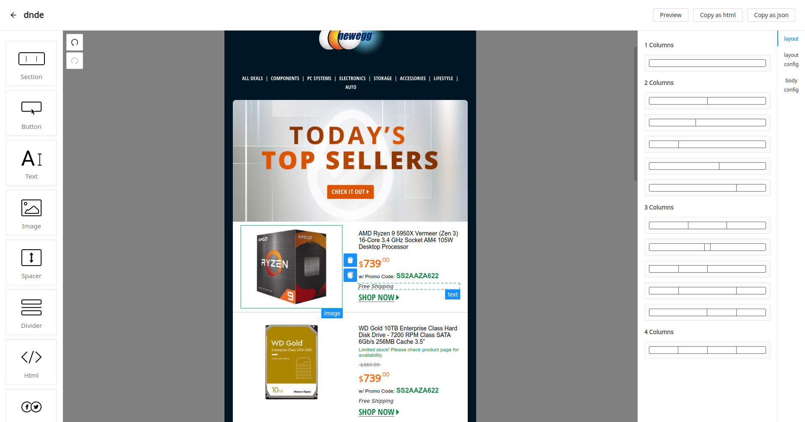
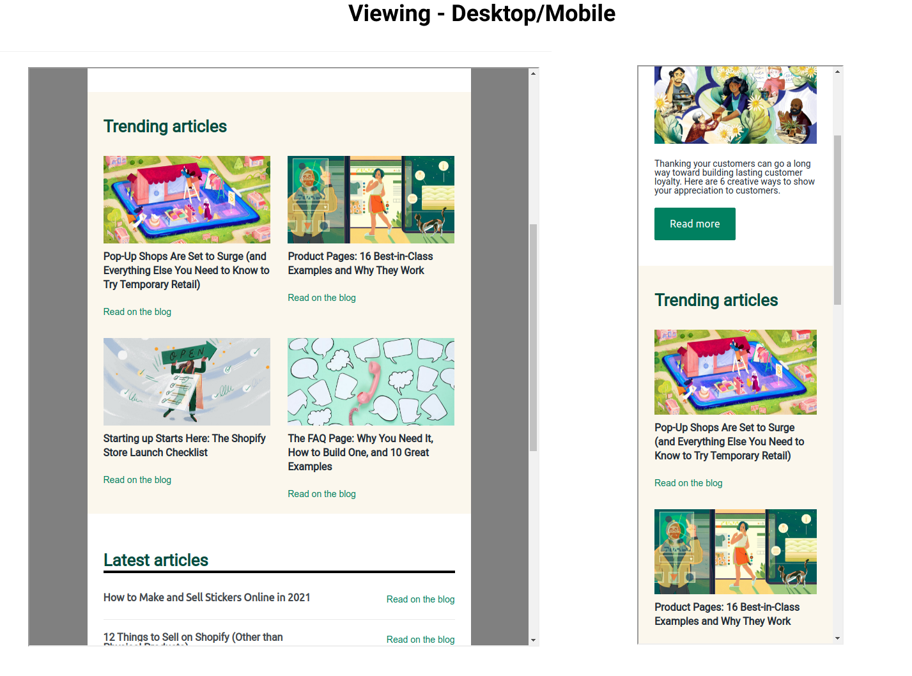

# Dnde - Mail (Drag and Drop Editor designed for mails)

> Drag and Drop E-mail editor

[![release][badge]][release link] [![license][license-badge]][license file]

[license-badge]: https://img.shields.io/github/license/aghontpi/dnde?style=flat-square
[license file]: https://github.com/aghontpi/dnde/blob/master/LICENSE
[badge]: https://img.shields.io/github/v/release/aghontpi/dnde?include_prereleases&style=flat-square
[release link]: https://github.com/aghontpi/dnde/releases

## Preview

## Features

- Responsive and mobile friendly emails
- Design emails by drag and drop
- Add custom fonts
- Export the design as html/json
- Preview the design in the browser (mobile & pc)
- UNDO and REDO functionality

## Logo Contributed by

[Saisohen](https://www.reddit.com/user/Saisohen/)

## Built with

- [React](https://facebook.github.io/react/)
- [MJML](https://mjml.io/)
- [antd](https://ant.design/)

## Inspired by

- [MailJet](https://www.mailjet.com/)
- [Unlayer](https://unlayer.com/)
